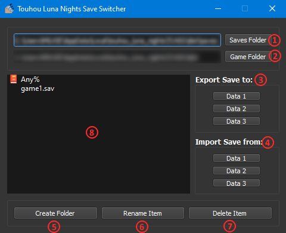

<h2 align="center">
Touhou Luna Nights Save Switcher
</h2>

<h4 align="center">
Speedrunning resource for Touhou Luna Nights that allows for organized storage and swapping of saves.
</h4>

-----

<h3>How to Run</h3>

Either build it yourself or download from [Releases](https://github.com/milkietoast/TLNSS/releases) when one is put out. You can also run it using python console commands. Make sure to install the PyQt5 package if running via Python.
  
The application was made on Windows 10 x64bit with Python 3.7.9 with the Steam version of Touhou Luna Nights and hasn't been tested elsewhere, I make no guarantees that it'll run on other architectures.

---

<h3>Usage</h3>
The application requires TLNSS.config.ini to be located in the same directory as the .exe or .py file. This stores the user's location for a saves/game folder. You can edit it directly to via the GUI.
  

Please make sure the saves/game folders do not contain any subdirectories/files you are afraid may be lost, as the applciation does allow you to delete files/folders through it.

  

1. Saves Folder: Allows for setting your save directory, it's best to set this to an empty directory with nothing you are afraid of losing by accidentally deleting.
2. Game Folder: Allows for setting your game directory in the TLNSS application, usually located at %appdata%/../Local/touhou_luna_nights
3. Export Save: Exports a save from the saves storage to the game directory at the selected save slot, replacing what is there if one already exists.
4. Import Save: Imports a save of the selected save slot from the game directory to the saves storage.
5. Create Folder: Creates a new directory in the saves folder.
6. Rename Item: Renames an item in both the view and on the filesystem.
7. Delete Item: Deletes a file or folder. DOES provide a confirmation popup to remind you what you're doing.

